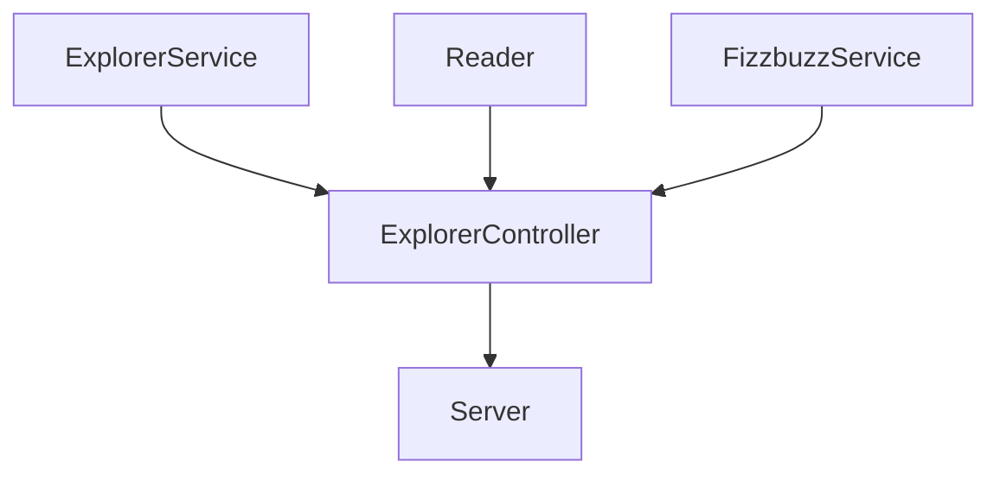

# Fizzbuzz

## Some libraries were used in this project:

- [Express](https://www.npmjs.com/package/express)
- [Jest](https://jestjs.io/)
- [Eslint](https://eslint.org/) 
- [dotenv](https://www.npmjs.com/package/dotenv)
- [node-telegram-bot-api](https://www.npmjs.com/package/node-telegram-bot-api)

If you want to download the project don't forget to run **`npm i`** to install the necessary dependencies

There are some scripts in the package.json to speed up some commands:
```javascript
"scripts": {
    "test": "node ./node_modules/jest/bin/jest.js",
    "linter": "node ./node_modules/eslint/bin/eslint.js .",
    "linter-fix": "node ./node_modules/eslint/bin/eslint.js . --fix",
    "server": "node ./lib/server.js",
    "bot": "node ./lib/bot.js"
},
```

- `npm run test` = To run the tests
- `npm run linter` = To examine the code according to the rules imposed in the .eslintrc.js file
- `npm run linter-fix` = To resolve errors according to the rules
- `npm run server` = To stand up the server
- `npm run bot` = To run telegram bot

## The logic distribution of this api is like this



## These are the available **endpoints**.
| Endpoint | Description |
|---|---|
| `localhost:3000/v1/explorers/:mission` | Filter by mission |
| `localhost:3000/v1/explorers/amount/:mission` | Amount of explorers in the mission |
| `localhost:3000/v1/explorers/usernames/:mission` | Filter by mission and return only their usernames |
| `localhost:3000/v1/fizzbuzz/:score` | Apply Fizzbuzz |

## Demo
-   ### Filter by mission
    
-   ### Amount of explorers in the mission
    
-   ### Filter by mission and return only their usernames
    
-   ### Apply Fizzbuzz
    
